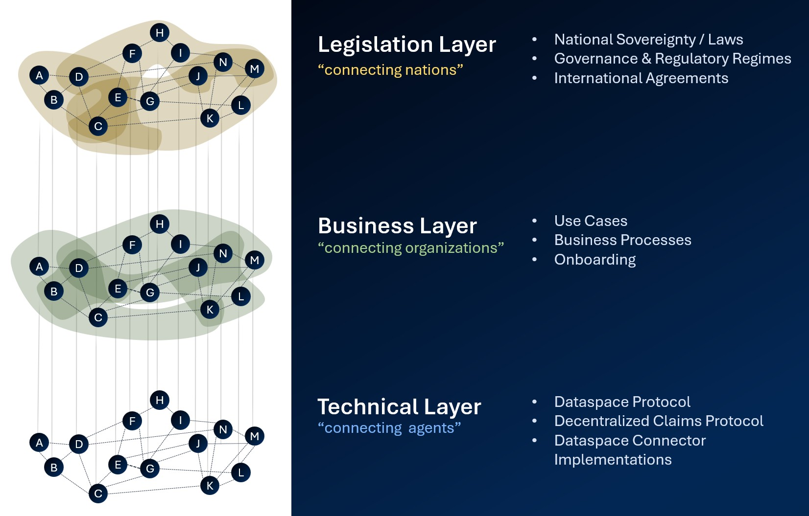
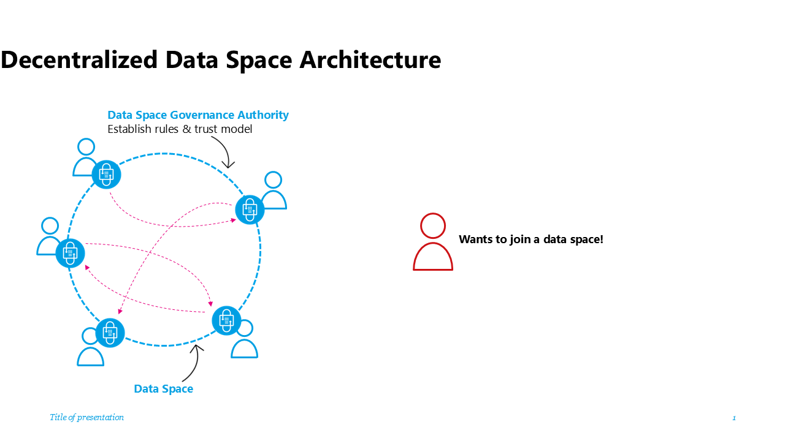
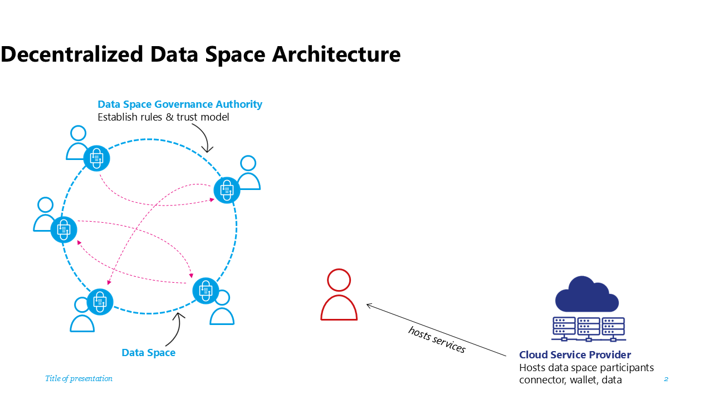
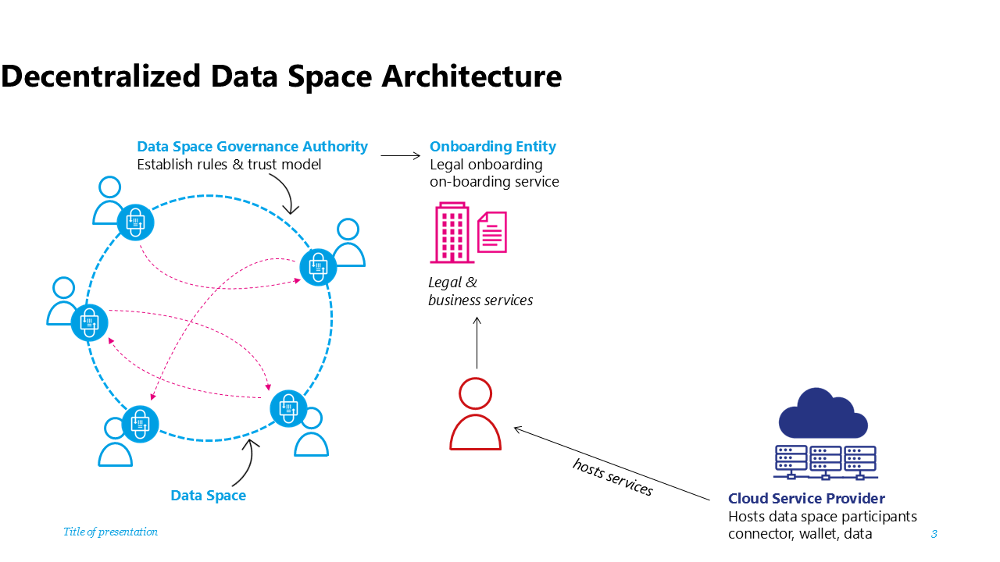
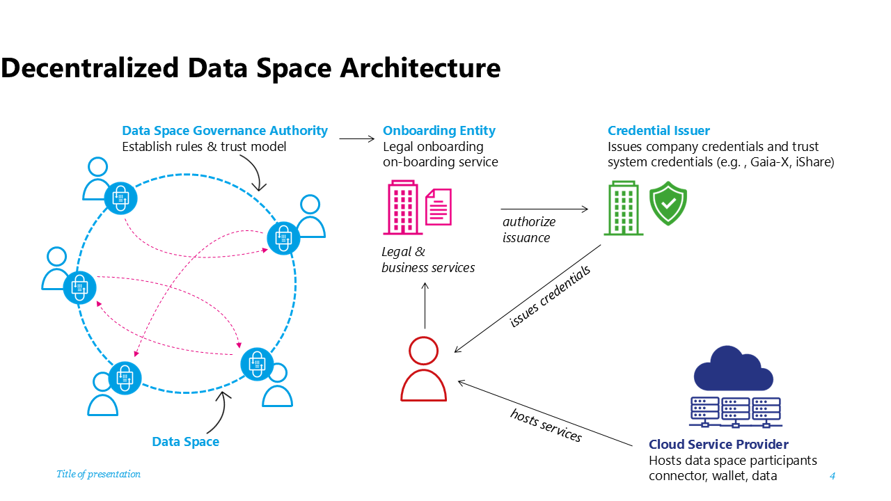
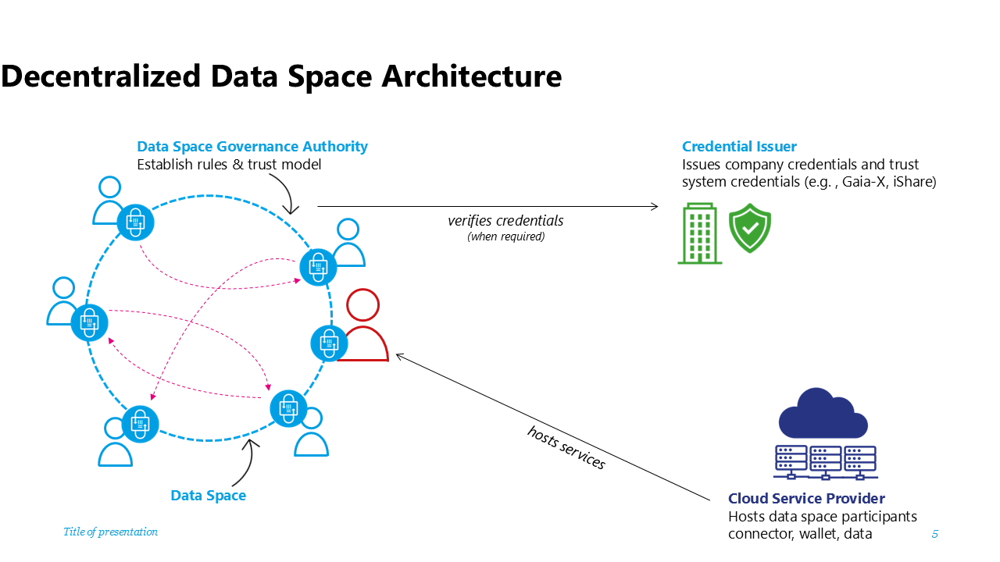

# Decentralized Dataspace Architectures are the Future for Digital Ecosystems
Maximizing Autonomy and Agency in Data Collaboration

## The Imperative for Decentralized Dataspaces
In an era defined by rapid digital transformation and complex data ecosystems, the architecture of dataspaces must empower participants with maximum autonomy and agency to support their digital sovereignty. A fully decentralized dataspace architecture stands out as the optimal approach, ensuring that all stakeholders retain control over their data, participate on equal footing, and benefit from robust interoperability while providing the necessary control, agility, robustness and performance needed for a world of trusted data sharing, community based data ecosystems, cooperative data sharing and interconnected, autonomous software agents driven by AI. This article explores the core principles and practical advantages of decentralization in dataspaces, highlighting alignment with the ISO 20151- “Dataspace concepts and characteristics”  standard, the critical roles within dataspaces, and the foundational technologies that enable seamless collaboration.

## Maximizing Participant Autonomy and Agency
At the heart of decentralized dataspace architecture is the principle of participant autonomy and agency. Each organization or entity operates independently, and is fully capable of deciding when to share which data assets with whom, under what circumstances and which rules apply to the usage of the shared data. Participants are managing their own credentials decribing their identity, without reliance on an external party controlling the their identity through a singular identity provider. They manage their interactions without centralized authorities or services. This approach protects digital sovereignty, allowing participants to decide how, when, and with whom their data is shared—critical for compliance, privacy, and strategic control. 

The architecture’s alignment with [ISO 20151](https://www.iso.org/standard/86589.html) further reinforces these values.

## Protocols for Interoperability: Leveraging DSP and DCP
Interoperability is essential for dataspaces to function as collaborative, decentralized meshes of participants. With connector implementations leveraging [Dataspace Protocol (DSP)](https://eclipse-dataspace-protocol-base.github.io/DataspaceProtocol)  and [Decentralized Claims Protocol (DCP)](https://eclipse-dataspace-dcp.github.io/decentralized-claims-protocol)   to facilitate seamless, standardized interactions between participants, technical interoperability between individual participants can be guaranteed irrespective of the Dataspace which is operating as a governance and business context on top of the mesh of participants. These protocols enable connectors to exchange data and services without vendor lock-in, ensuring that integrations remain flexible, secure, and future-proof.
Let’s revisit the mental model of layers of a dataspace. At the technical layer a dataspace consists of a decentralized mesh of individual nodes, which are acting with full autonomy and agency. Only in the higher layers of business and legislation processes the segmentation into separated trust contexts are manifesting. Such trust contexts can be “strong borders”, representing boundaries between dataspaces in different nations, but also can be “weaker borders”, representing a segmentation into individual use cases within a dataspace. No matter where the segmentation takes place, all use cases are unified by the common, interoperable technology, founded on a solid base of the DSP and DCP.
 

## Roles in the Dataspace: Governance Authority and Participant
Decentralized dataspace architectures define only two essential roles: the **Dataspace Governance Authority (DSGA)** and the **Participant**. The DSGA establishes rules and specifies which Dataspace Trust Frameworks (DTFs) will be used,  who operates the accepted Onboarding Services and which mandatory business processes exist, while participants actively engage in the dataspace to negotiate data sharing contracts and execute existing agreements. Notably, service provider organizations can host governance and onboarding services, providing the necessary legal and business frameworks for onboarding and compliance.

Any business role within the dataspace, e.g. Provider, Consumer, Auditor, Marketplace, and many others can be built as a specialization of the technical role of the participant. 

There is no need for custom technical architectures or specialized protocols to satisfy those business roles and their requirements. No additional architectural components (e.g. central or federated catalogs, identity providers, etc…) are needed to create an operational dataspace. On the contrary, adding such special architectural components reintroduces centralization and fragility to the dataspaces and becomes a single point of control and potential failure, very often resulting in performance bottlenecks or preferred attack points during cybersecurity events.

## Trust Frameworks and Credential Management
Trust within the dataspace is governed by at least one Dataspace Trust Framework (DTF). DTFs contain the rules that are fundamental to trust creation within the data space. An empty DTF/no DTF also qualifies as a DTF as no rules can be interpreted as data being shared with anyone without conditions (e.g.: Open Data). 

DTFs can be built hierachically by partial DTFs, external DTFs, DTF building blocks, etc. It is the responsibility of the DSGA to and/or the participant to resolve potential conflicts between used DTFs to arrive at a final set of rules without ambiguity. If a data asset is offered under two different rule sets it is being represented as two different contract offers.

Optionally a data space may anchore one or more DTFs in an external DTF Issuer, which act as credential issuer / signer. 

Instead of maintaining membership lists, the architecture relies on onboarding credentials — requested/issued and managed by participants themselves, checked and validated by onboarding services and signed by signatory services, the credential issuance service of the DTFs. This model ensures that each participant is responsible for their own credential lifecycle, promoting autonomy and reducing administrative overhead.

Credential verification is handled on-demand, reinforcing the decentralized nature of the dataspace and minimizing the risk of single points of failure or control.

## Advanced Business Functions: Mapping to Participant Roles
Advanced business cases such as participant matching, observer roles, and data marketplaces can be easily mapped to the participant role. For example:
-	Marketplace/Matching Participants: Multiple participants can provide a service that allows the  discovery of and connection with other participants using catalogs and vocabularies, without central mediation. Each participant that wants to participate in a marketplace or a matching service shares their metadata through a data sharing contract with the Marketplace/Matching Service Provider Participant, who then in return will offer a data sharing contract with the potential matches. All within the rules of the dataspace, ensuring that autonomy and agency is preserved. Having multiple, independent such Service Providers will greatly enhance the freedom of choice and resiliency of the data ecosystem.
-	Observers: Entities wishing to observe or audit interactions within the dataspace can do so by joining as participants with observer-specific credentials. Participants that are negotiating a contract that requires auditing can then both negotiate a data sharing agreement with the Observer participant to share their individual log files of the transaction. The Observer will provide the service of auditing and reconciling those log files and in return issue a data sharing agreement with the two participants where the results of the audit will be shared. Again, all perfectly within the rules and processes of the dataspace, fully preserving participant autonomy and agency.
-	Data Escrow Service Providers: Data escrow operations are managed by participants acting as service providers, who are offering a trusted data escrow environment - a confidential compute environment where two or more participants can share their data and have computation being performed on the data without any of those participants ever having access to all data at once. The Data Escrow Service Provider participant guarantees the operation of the environment, and the distribution of results. With special encryption methods it can also be guaranteed that the Data Escrow Service Provider never gets to see the actual data. This is enabling joint analysis of data  while ensuring the highest level of data privacy. E.g., in medical research scenarios or financial services.

When designing the data space business functions it is important to pay attention that the introduction of mandatory value-added services might introduce unwanted centralization or federation thus leading to undesirable concentration of control and accidental single point of failures/attack that can negatively affect the participants in the dataspace. It is highly recommended to enable an open market of competing value-added services to ensure higher resiliency and avoid centralization of control.

## A practical approach to  Decentralized Dataspace Architecture
### Joining a dataspace
Decentralized dataspace architecture emphasizes the autonomy and agency of participants, thus it must be a voluntary decision of a participant to join a dataspace. 
 

### Selecting a hosting model and provider
However, with great power also comes great responsibility, so the participant has some work to do. It’s not like joining a centralized platform, where one creates an account and that’s it. The participant needs to actively make a decision on where to operate the technology that’s needed to be active in a dataspace: The dataspace connector, the wallet, data staging areas, etc… Although this seems to be a complex and difficult task to accomplish it is ultimately what enables digital sovereignty. Every participant can operate on the infrastructure of their choice and they can make an autonomous decision on how much agency to have. Any operating model available - from on premises to  classical cloud computing is also possible for dataspace technologies: starting at a fully customized hosting model on one end of the spectrum, a platform as a service model for connectors and wallets, all the way to fully managed use case services (e.g. a data intermediary offering a Digital Product Passport service including sharing capabilities to a manufacturing dataspace) on the other side of the spectrum. Further, such components might be operated for an individual dataspace or reusable for a multitude of dataspaces by leveraging dynamic contexts and configuration capabilities.

### Onboarding to a dataspace
Once the future participant has all technical components up and running they need to understand the rules and processes of the dataspace, maybe sign some legal contracts of the dataspace organization, provide evidence on their claims that they satisfy the rules of the dataspace and many other steps needed to be onboarded to the dataspace. This can be done by an onboarding service provided by the organization representing the community of the dataspace (e.g. a not for profit organization, a government entity responsible for a regulatory dataspace, or a commercial entity leading a dataspace created around their organization and its partners). This onboarding service is needed only as a one-time access point while joining the dataspace. It might have an additional service like notifying existing members that a new member is joining, but usually will not be needed for the ongoing operation of the dataspace. 

It is important to understand that in a decentralized architecture, no ongoing dependency on a central or federated services should be mandated. As this example illustrates on popular mechanism to realize a decentralized architecture there are other solution paths as well.
 

If the data space relies on an onboarding entity to manage the onboarding process this entity can ensure the adherance to membership rules and potential additional steps like checking the validity of external DTF credentials.

If there is no onboarding entity a new participant could simply prove their eligibility to be a member of the data space by providing claims to another participant who accepts the membership after evaluating all membership rules and the claims provided.

There are many other models of how membership of a dataspace can be established. For further process steps in this article the focus will be on the scenario of an Onboarding Entity working with an external credential issuer.

Often the Onboarding Entity can directly issue membership credentials for the new participant, however, in this scenario it requires additional steps from external actors, the Credential Issuers from a DTF which are being used within the dataspace.

### Obtaining Credentials from external Dataspace Trust Frameworks
In complex, large-scale data spaces  a Dataspace Governance Authority will not define every single rule of the dataspace but rely on existing Dataspace Trust Frameworks to provide building blocks from which to construct the DSGAs rules for this specific dataspace. E.g. Gaia-X could be leveraged to provide labeling for the infrastructure providers used by individual participants, iSHARE could be supporting the legal onboarding of participants. In those cases the Onboarding Service will need to collaborate with the onboarding/issuing services of the various DTFs. However, the ultimate responsibility of maintaining credentials about their claims is with the participant. So although the Onboarding Service of the Dataspace might collaborate with the Issuance Service of the DTF the DTF credential has to be issued directly to the dataspace participant. Alternatively the credential issuance can also be requested by the participant.

This process might have to be repeated for every credential issuer that is being used within the data space. It might also be possible that the participant already holds a credential from accepted external DTF credential issuers due to their membership in another data space. It is possible that this are accepted by the data space. 

Once issued the dataspace participant can use this credential together with the membership credentials from the Dataspace Onboarding Service to provide evidence of its claims when negotiating a sharing contract with other participants of the dataspace.

It is important to note that many variations of this process can exist and it is part of the role of the DSGA to define the exact business process which leads to the set of credentials that are then resulting in a membership credential for the data space in question. This process can be influenced by business needs, regulation, and other external factors.
 

### Using credentials in the dataspace
When two participants of a dataspace interact it will be necessary to match policy constraints of one party to the claims that the other party presents. In most cases it will be sufficient to verify the signature of the credential issuer and the expiration date as the claim is presented by the participant. After all cryptographical methods will enable the other party to verify that the presented credential is representing the counterparty and has been signed by the credential issuer. However, in more complex cases it might be necessary to check the validity of a signature synchronously with the Credential Issuer. One such example can be the necessity of near real-time checks of the revocation of a credential.
 

## Global Dataspace Connector Mesh
As decentralized architectures proliferate, a global mesh of dataspace connectors is emerging. Each dataspace maintains its own legal and trust boundaries, ensuring that governance and compliance are localized and context-specific. At the same time, the underlying technologies—connectors, protocols, credential management systems—are reusable across multiple dataspaces, maximizing efficiency and reducing duplication.
This mesh enables organizations to participate in multiple dataspaces seamlessly, leveraging consistent standards and interoperable technologies.

## Use Case Segmentation
Segmentation within the dataspace is achieved via use case-specific credentials which might be issued by credential issuers that are providing specialized DTFs for a specific use case. For instance, in the automotive supply chain, manufacturers, suppliers, and logistics providers each hold credentials tailored to their role and use case. Use cases could be anything from specific business processes, regulatory requirements to smaller communities created by the supply chain of a specific company. This segmentation ensures that data access, sharing, and collaboration are precisely controlled, supporting advanced business models such as just-in-time delivery, quality assurance, and regulatory compliance.

## Conclusion
A fully decentralized dataspace architecture delivers unmatched benefits in participant autonomy, digital sovereignty, and interoperability. By aligning with ISO 20151, leveraging DSP and DCP protocols, and streamlining roles and credential management, organizations can build robust, flexible, and future-ready data ecosystems. As the global connector mesh expands and technology is reused across domains, the potential for innovation and collaboration grows exponentially. Segmentation via use case-specific credentials ensures that each participant operates within precise trust boundaries and as effectively as possible, paving the way for the next generation of digital business.

